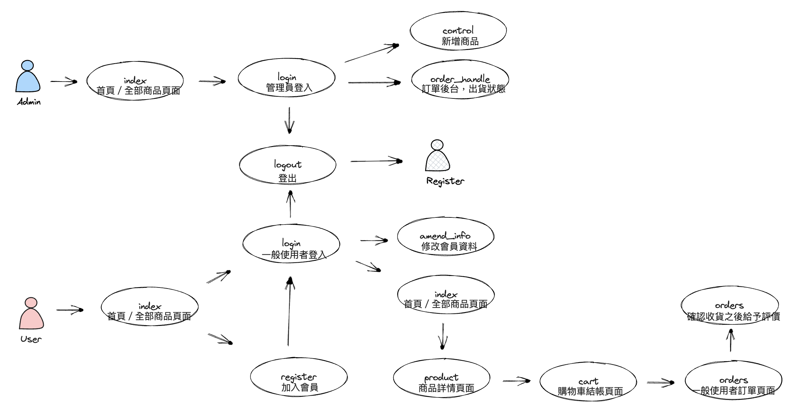

# JavaWeb Spring + SpringMVC + Hibernate 書店購物車練習

### 專案介紹
個人練習用專案，使用Spring + SpringMVC + Hibernate 製作的書店購物車，並且 Connection Pool 使用 C3P0 ，頁面使用 JSP 呈現

### 運行環境
Server : Tomcat v9.0

BackEnd : Java JDK 8 + Spring + SpringMVC + Hibernate + MySql + C3P0 + JSP

FrontEnd : Bootstrap

### 資料庫環境
spring.datasource.url=jdbc:mysql://127.0.0.1:3306/growBook?useUnicode=yes&characterEncoding=UTF-8

spring.datasource.username=root

spring.datasource.password=password

spring.datasource.driver-class-name=com.mysql.jdbc.Driver
###### 詳細位置於/springMVC-growbook/src/main/resources/properties/database.properties檔案內可修改上述設定

### UseCase

### DemoVideo
[springMVC-GrowBook書店購物車操作](https://youtu.be/SViOVkArW78)

### 回顧與展望
總算完成一個基本可以註冊、登入會員以及使用購物車和商品管理的書店網站，並且也學會基本的 Hibernate 和 Connection Pool 知識，

接下來希望可以加上 
1. Docker File
2. RabbitMQ File
3. PostgreSQL 等其他資料庫 database.properties